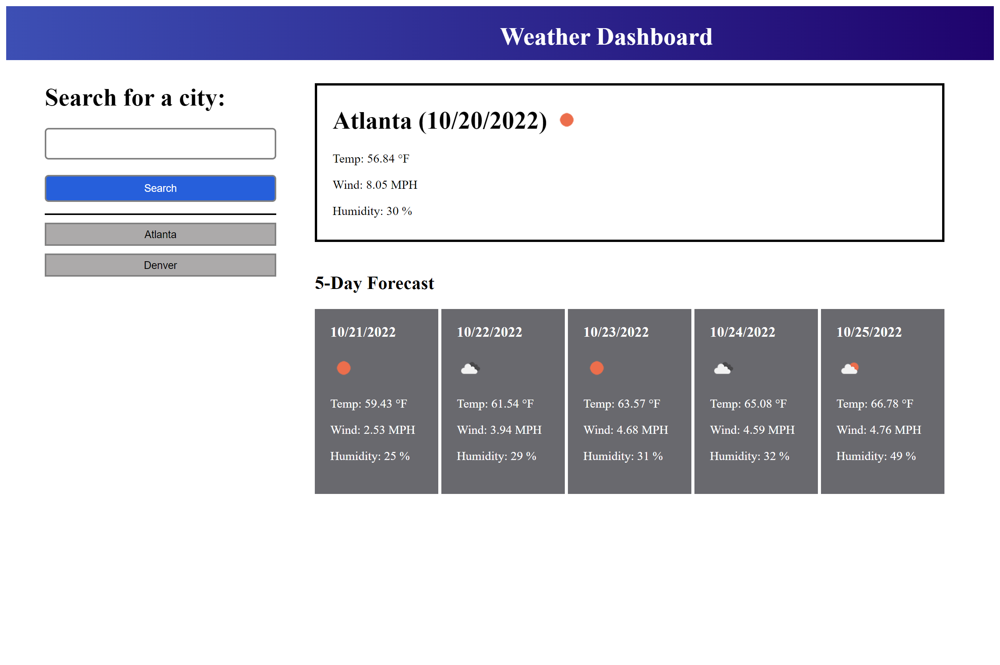

# Tablero meteorológico

## En este sexto desafío se ha creado una aplicación de tablero meteorológico que cumple con la siguiente funcionalidad:

* Cuando se introduce y se busca una ciudad, se muestran las condiciones actuales y futuras para esa ciudad.
* Las condiciones actuales desplegadas incluyen:
    * Nombre de la ciudad.
    * Fecha.
    * Ícono que representa las condiciones del clima.
    * La temperatura, la velocidad del viento y la humedad en °F, MPH (miles per hour) y %, respectivamente.
* Las condiciones futuras contemplan un pronóstico de 5 días.
* Las condiciones futuras incluyen:
    * Fecha.
    * Ícono que representa las condiciones del clima.
    * La temperatura, la velocidad del viento y la humedad en °F, MPH (miles per hour) y %, respectivamente.
* Igualmente, la ciudad introducida, se agrega al historial de búsqueda.
* Al actualizar la página de la aplicación, el historial de búsqueda permanece.
* Cuando se hace clic sobre alguna ciudad contenida en el historial de búsqueda, se despliegan sus condiciones actuales y futuras.

## Se puede acceder a la aplicación por medio del siguiente link:

* [Link a aplicación](https://jorgeramirezanzaldo.github.io/Tablero-Meteorologico/)

## La aplicación luce tal como se muestra en la siguiente imagen:

## A continuación se presenta una animación sobre el funcionamiento de la aplicación:

